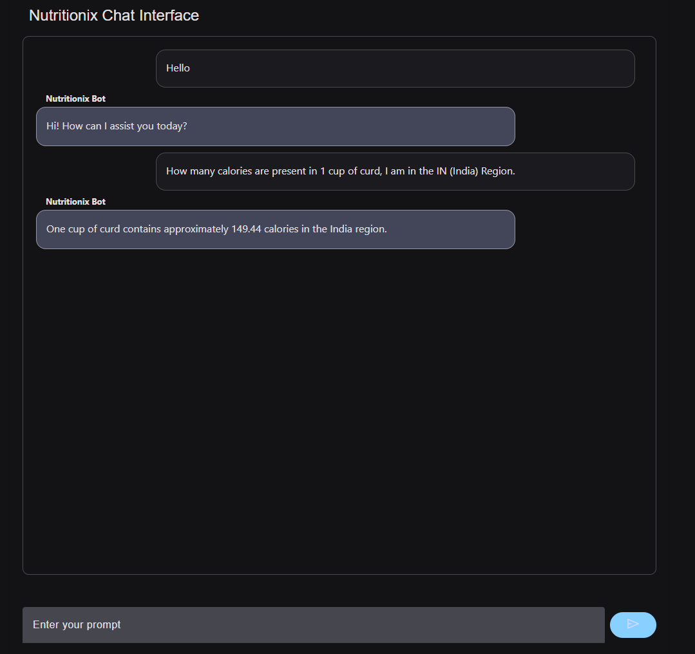

## Project Overview

**Nutritionix-MCP Chat** is a prototype chat application that lets users log meals in natural language. It parses food items via an MCP server backed by the Nutritionix API and returns detailed calorie and macronutrient breakdowns. Core technologies:

- **FastAPI** backend with WebSocket/chat endpoints  
- **FastMCP** server exposing Nutritionix tools  
- **LangChain-Ollama** orchestrator for tool‐calling and reasoning  
- **Google Mesop** frontend for a lightweight chat UI  

## Features

- **Natural-language meal logging** (“I had 1 katori dahi and 2 chapatis”)  
- **Automatic tool-calling** to Nutritionix’s natural nutrients API  
- **Regional unit conversion** (e.g. ounces vs. litres via `alt_measures`)  
- **Macro tracking**: calories, protein, carbs, fats  
- **Modular LLM orchestration**: swap Ollama models via `llm_provider.py`  
- **Lightweight Python UI** using Mesop’s `mel.chat`  

## UI Preview

